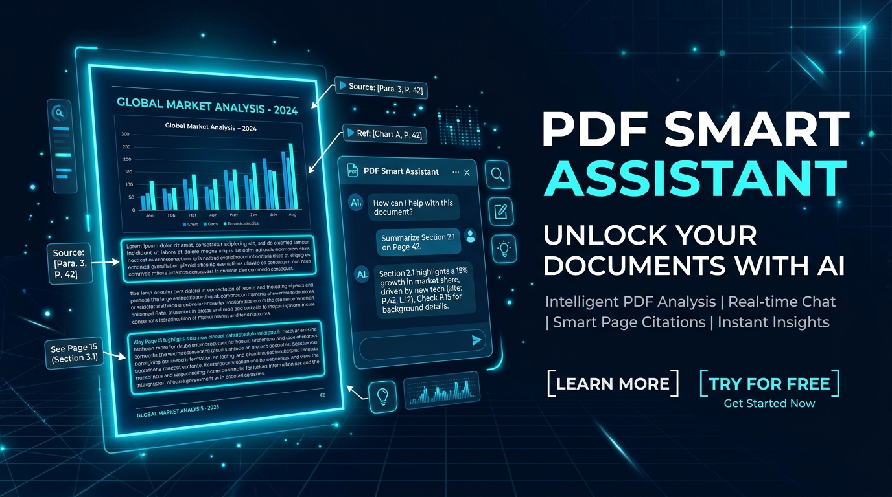
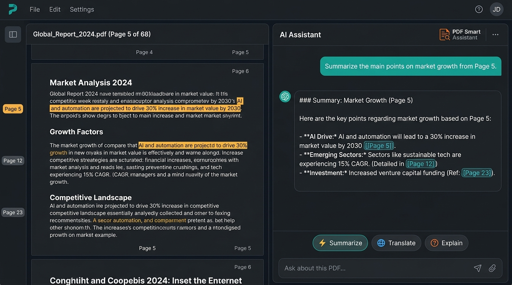

<div align="center">

# 📑 PDF Smart Assistant
### AI-Powered Document Intelligence & Interactive PDF Assistant

[](https://aistudio.google.com/)
[](https://reactjs.org/)
[](https://www.typescriptlang.org/)
[](https://vitejs.dev/)
[](https://tailwindcss.com/)
[](https://opensource.org/licenses/MIT)

<br />



</div>

---

## 🌟 Genel Bakış (Overview)

**PDF Smart Assistant**, PDF ve Word (.docx, .doc) belgelerinizle doğal bir dilde etkileşim kurmanızı sağlayan yeni nesil, yapay zeka destekli bir doküman analiz ve okuma platformudur.

Google'ın en gelişmiş **Gemini 2.5 Flash** modelini ve **Google GenAI File API** altyapısını kullanarak belgelerinizin tamamını anlar, sayfa referanslı akıllı yanıtlar üretir ve seçtiğiniz metinler üzerinde anında işlem yapmanıza olanak tanır.

<div align="center">
  
</div>

---

## 🚀 Öne Çıkan Özellikler (Key Features)

- 📄 **Geniş Belge Desteği**: PDF dosyalarının yanı sıra Word (.docx ve .doc) belgelerini otomatik ayrıştırıp analiz eder.
- ⚡ **Google Gemini 2.5 Flash Gücü**: Dokümanları Google File API üzerinden doğrudan yapay zeka ile eşleştirerek yüksek hızlı ve derinlemesine yanıtlar üretir.
- 🔗 **Tıklanabilir Sayfa Referansları ([Sayfa X])**: Yapay zekanın verdiği yanıtlardaki sayfa etiketlerine tıkladığınızda belge otomatik olarak ilgili sayfaya kaydırılır.
- 🪄 **Akıllı Kayan Araç Çubuğu (Floating Toolbar)**: Belgede herhangi bir metni seçtiğinizde anında beliren menü ile:
  - 📝 **Özetleme (Summarize)**: Seçili bölümün özetini çıkartır.
  - 🌐 **Çeviri (Translate)**: Seçili metni Türkçeye veya İngilizceye çevirir.
  - ✨ **Yeniden Yazma (Rephrase)**: Metni daha akıcı, akademik ve profesyonel bir üslupla düzenler.
- 🔍 **Gelişmiş Belge Görüntüleyici**: Sayfa zoom (yakınlaştırma/uzaklaştırma), sayfa atlama, metin seçimi ve tam responsive görüntüleme.
- 💻 **Masaüstü (.exe) Derleme Desteği**: Bun altyapısıyla tek tıkla taşınabilir bağımsız Windows `.exe` çıktısı alabilme.

---

## 🛠️ Mimari & Teknolojiler

| Katman | Teknoloji / Kütüphane | Açıklama |
| :--- | :--- | :--- |
| **Yapay Zeka** | `@google/genai` (Gemini 2.5 Flash) | Belge anlama, akışlı yanıt (streaming) ve hızlı işlem yeteneği |
| **Frontend** | React 18, TypeScript, Vite, Tailwind CSS v4 | Hızlı, reaktif ve modern kullanıcı deneyimi |
| **PDF Motoru** | `react-pdf`, `pdfjs-dist`, `pdf-lib` | Gelişmiş PDF render ve sayfa manipülasyonu |
| **Word Ayrıştırma** | `mammoth`, `word-extractor` | .docx ve .doc belgelerinden metin ve HTML çıkarma |
| **Backend** | Express.js, Multer, CORS | Dosya yükleme ve yapay zeka streaming sunucusu |

---

## ⚙️ Kurulum & Çalıştırma (Getting Started)

### 📋 Gereksinimler
- [Node.js](https://nodejs.org/) (v18 veya üzeri önerilir)
- [Git](https://git-scm.com/)
- [Google Gemini API Key](https://aistudio.google.com/)

---

### 1️⃣ Depoyu Klonlayın

```bash
git clone https://github.com/yaman-sener/PDF-Smart-Assistant.git
cd PDF-Smart-Assistant
```

### 2️⃣ Bağımlılıkları Yükleyin

```bash
npm install
```

### 3️⃣ Ortam Değişkenlerini Ayarlayın

Proje kök dizinindeki `.env.example` dosyasını kopyalayarak `.env` oluşturun:

```bash
# Windows PowerShell
copy .env.example .env

# Mac / Linux
cp .env.example .env
```

Ardından `.env` dosyasını açıp [Google AI Studio](https://aistudio.google.com/)'dan aldığınız API anahtarınızı girin:

```env
GEMINI_API_KEY="AIzaSyYourGeminiApiKeyHere"
APP_URL="http://localhost:3000"
NODE_ENV="development"
```

---

### 4️⃣ Uygulamayı Başlatın

Geliştirme modunda başlatmak için:

```bash
npm run dev
```

Tarayıcınızda açın: **[http://localhost:3000](http://localhost:3000)**

---

## 📦 Masaüstü Uygulaması Olarak Derleme (Build .exe)

Projeyi tek bir bağımsız Windows `.exe` dosyası haline getirmek için [Bun](https://bun.sh/) kullanarak derleyebilirsiniz:

```bash
npm run build
npm run build:exe
```

Oluşturulan çalıştırılabilir dosya `dist/pdf-smart-assistant.exe` konumunda yer alacaktır.

---

## 📁 Proje Dizin Yapısı

```
pdf-smart-assistant/
├── assets/                  # Banner, logo ve önizleme görselleri
│   ├── banner.jpg
│   └── preview.jpg
├── src/
│   ├── components/          # React bileşenleri
│   │   ├── ChatPanel.tsx    # AI sohbet ve etkileşim paneli
│   │   ├── FloatingToolbar.tsx # Metin seçim araç çubuğu
│   │   └── PDFViewer.tsx    # PDF görüntüleyici ve sayfa kontrolleri
│   ├── App.tsx              # Ana uygulama düzeni
│   ├── main.tsx             # React giriş noktası
│   ├── index.css            # Tailwind stilleri
│   └── types.ts             # Tip tanımları
├── server.ts                # Express backend & Gemini API entegrasyonu
├── vite.config.ts           # Vite konfigürasyonu
├── tsconfig.json            # TypeScript konfigürasyonu
├── .env.example             # Örnek ortam değişkenleri
├── .gitignore               # Git tarafından yok sayılacak dosyalar
└── package.json             # Bağımlılıklar ve scriptler
```

---

## 🔑 Ortam Değişkenleri (Environment Variables)

| Değişken Adı | Zorunlu mu? | Açıklama |
| :--- | :---: | :--- |
| `GEMINI_API_KEY` | **Evet** | Google AI Studio üzerinden alınan Gemini API anahtarı. |
| `APP_URL` | Hayır | Uygulamanın çalıştığı ana URL (Varsayılan: `http://localhost:3000`). |
| `NODE_ENV` | Hayır | `development` veya `production` modu. |

---

## 🤝 Katkıda Bulunma (Contributing)

Katkılarınız projeyi daha iyi hale getirecektir! Lütfen adımları takip edin:

1. Bu depoyu Fork'layın (`Fork`)
2. Yeni bir özellik dalı açın (`git checkout -b feature/YeniOzellik`)
3. Değişikliklerinizi commit edin (`git commit -m 'feat: Yeni özellik eklendi'`)
4. Dalınızı push edin (`git push origin feature/YeniOzellik`)
5. Bir **Pull Request (PR)** oluşturun

---

## 📄 Lisans (License)

Bu proje [MIT Lisansı](LICENSE) altında lisanslanmıştır.

---

<div align="center">
  Geliştirici: <b>Yaman Şener</b> • <a href="https://github.com/yaman-sener">GitHub Profilim</a>
</div>
